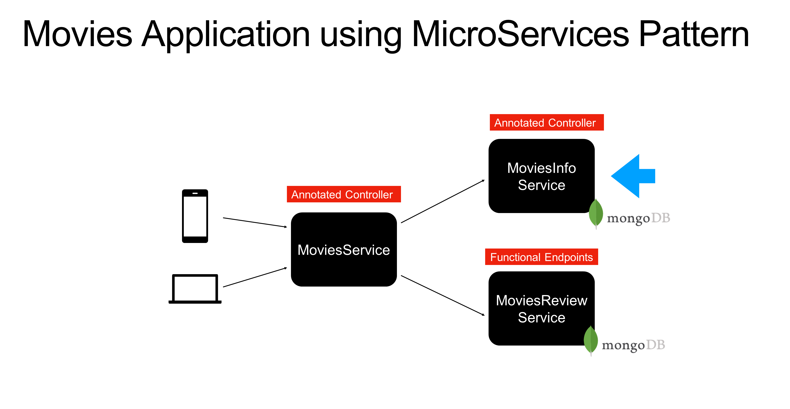

# reactive-spring-webflux
 
Udemy course: Build Reactive MicroServices using Spring WebFlux/SpringBoot
https://www.udemy.com/course/build-reactive-restful-apis-using-spring-boot-webflux/

Certificate: https://www.udemy.com/certificate/UC-f4b1fc22-39f8-457a-be0a-0365335f888f/

